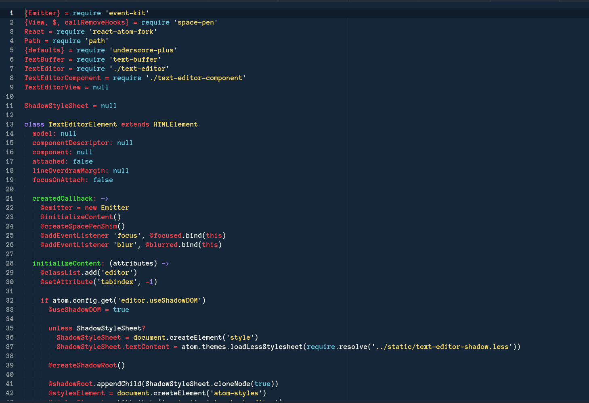
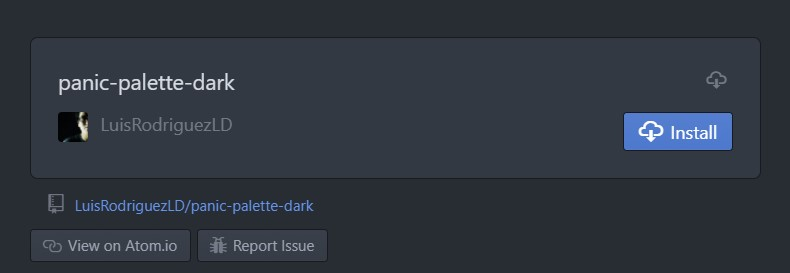

# PANIC THEME

Do you wanna have the coolest theme of all time?

Panic Palette Dark uses the proper colors to create a theme you can not do without.

With a general dark based theme, and bright colored variables and elements, this theme  
is ideal for those who spent many hours in front of their monitors because it is both  
relaxing and distinct at the same time

```
// General colors
@syntax-text-color: #f6f7ee;
@syntax-cursor-color: #a982ff;
@syntax-selection-color: #31343A;
@syntax-background-color: #15191E;
```

Find the package on the official site of atom:

[PANIC THEME ON ATOM](https://atom.io/packages/panic-palette-dark)

## Preview



## Installation 

You can install the package from the official Atom Package Installer:  

- Go to **Settings > Install**  
- Search for `panic-palette-dark` and click **Install**  
- Go to **Settings > Themes** and choose **Panic Palette Dark** from the dropdown menu  





